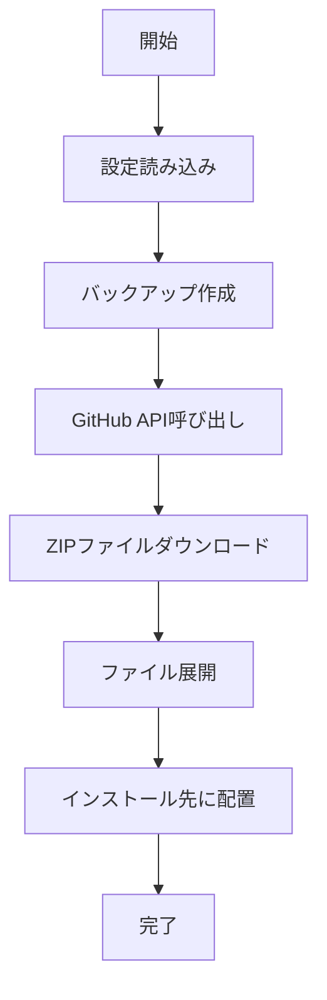
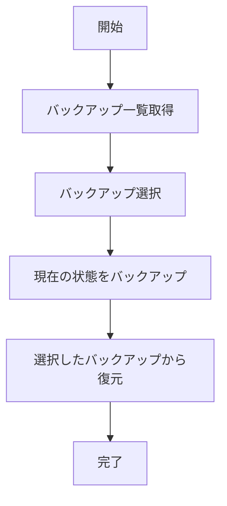

# tModLoader インストーラー 詳細仕様書

## 概要

tModLoader インストーラーは、tModLoader v2025.02.3.2 のクライアントインストール手順を自動化する Python アプリケーションです。

## アーキテクチャ

### ディレクトリ構造

```
tmodloader_installer/
├── __init__.py              # パッケージ初期化
├── __main__.py              # メインエントリーポイント
├── core/                    # コア機能
│   ├── __init__.py
│   └── installer.py         # SimpleInstaller
├── gui/                     # GUI関連
│   ├── __init__.py
│   ├── main_window.py       # メインウィンドウ
│   ├── dialogs/             # ダイアログ
│   │   ├── __init__.py
│   │   └── backup_dialog.py # バックアップ選択ダイアログ
│   └── widgets/             # ウィジェット
│       ├── __init__.py
│       └── log_window.py    # ログ表示ウィンドウ
├── cli/                     # コマンドライン
│   ├── __init__.py
│   └── main.py              # CLIメイン
├── utils/                   # ユーティリティ
│   ├── __init__.py
│   ├── constants.py         # 定数定義
│   └── helpers.py           # ヘルパー関数
├── config/                  # 設定ファイル
│   └── gui_config.json
├── backups/                 # バックアップ（実行時生成）
└── downloads/               # ダウンロード（実行時生成）
```

## 機能仕様

### コア機能

#### 1. ダウンロード機能

- **GitHub Release API**: リリース情報の取得
- **ZIP ファイルダウンロード**: 指定された URL から ZIP ファイルをダウンロード
- **整合性確認**: ダウンロードしたファイルの検証

#### 2. バックアップ機能

- **自動バックアップ**: 既存の tModLoader フォルダをタイムスタンプ付きでバックアップ
- **バックアップ管理**: 複数のバックアップの管理と削除
- **復元機能**: 選択したバックアップからの復元

#### 3. インストール機能

- **ZIP 展開**: ダウンロードした ZIP ファイルの展開
- **ファイル配置**: 展開したファイルを指定先に配置
- **上書き処理**: 既存ファイルの安全な上書き

### GUI 機能

#### 1. メインウィンドウ

- **入力フィールド**: GitHub URL、インストール先パスの入力
- **ボタン**: インストール開始、バックアップ復元、ログ表示
- **プログレスバー**: 0-100%の進捗表示
- **設定保存**: 入力内容の自動保存

#### 2. バックアップ選択ダイアログ

- **バックアップ一覧**: 利用可能なバックアップの表示
- **自然ソート**: 日時順（新しいものが上）での並び替え
- **削除機能**: 選択したバックアップの削除
- **確認ダイアログ**: 削除前の確認

#### 3. ログウィンドウ

- **リアルタイム表示**: ログメッセージのリアルタイム更新
- **スクロール**: 自動スクロール機能
- **ウィンドウ管理**: 独立したウィンドウでの表示

## 技術仕様

### 依存関係

```toml
[project]
name = "tmodloader-installer"
version = "0.1.0"
description = "tModLoader installer tool"
requires-python = ">=3.8"
dependencies = [
    "requests>=2.25.0",
]
```

### 使用技術

- **Python 3.8+**: メイン言語
- **Tkinter**: GUI フレームワーク
- **requests**: HTTP 通信
- **zipfile**: ZIP ファイル処理
- **shutil**: ファイルシステム操作
- **pathlib**: パス操作
- **threading**: 非同期処理
- **json**: 設定ファイル処理

### 設定ファイル

#### gui_config.json

```json
{
  "github_url": "https://github.com/tModLoader/tModLoader/releases/tag/v2025.06.3.0",
  "install_path": "C:\\Program Files (x86)\\Steam\\steamapps\\common\\tModLoader"
}
```

## 処理フロー

### インストール処理



### 復元処理



## エラーハンドリング

### エラー種別

1. **ネットワークエラー**: インターネット接続なし、API 呼び出し失敗
2. **ファイルエラー**: ファイルアクセス権限なし、ディスク容量不足
3. **設定エラー**: 無効な URL、存在しないパス
4. **システムエラー**: 管理者権限なし、メモリ不足

### エラー処理

- **ログ出力**: 詳細なエラー情報をログに記録
- **ユーザー通知**: 分かりやすいエラーメッセージを表示
- **復旧処理**: 可能な限り処理を継続
- **ロールバック**: 失敗時の状態復元

## パフォーマンス

### メモリ使用量

- **基本**: 約 50MB
- **ダウンロード時**: 約 200MB（ZIP ファイルサイズによる）
- **展開時**: 約 300MB（一時的な使用）

### 処理時間

- **バックアップ作成**: 1-3 分（ファイル数による）
- **ダウンロード**: 30 秒-5 分（ネットワーク速度による）
- **インストール**: 30 秒-2 分（ファイル数による）

## セキュリティ

### 権限管理

- **管理者権限**: ファイルシステムへの書き込み権限
- **ネットワークアクセス**: GitHub API への HTTPS 通信のみ

### データ保護

- **バックアップ暗号化**: なし（ローカルファイルのみ）
- **通信暗号化**: HTTPS 使用
- **ログ情報**: 機密情報の除外

## テスト

### テスト環境

- **OS**: Windows 10/11
- **Python**: 3.8-3.12
- **権限**: 管理者権限

### テスト項目

1. **正常系**: 基本的なインストール・復元
2. **異常系**: ネットワークエラー、権限エラー
3. **境界値**: 大きなファイル、多数のバックアップ
4. **UI**: ボタン操作、ダイアログ表示

## デプロイメント

### 実行ファイル作成

```bash
# PyInstallerを使用
uv run python build_exe.py
```

### 配布ファイル

- `tModLoaderInstaller.exe`: メイン実行ファイル
- `icon.ico`: アプリケーションアイコン

## 今後の拡張予定

### 機能追加

- **自動更新**: アプリケーション自体の自動更新
- **設定エクスポート/インポート**: 設定のバックアップ・復元
- **複数バージョン管理**: 複数の tModLoader バージョンの管理
- **プラグインシステム**: カスタム機能の追加

### 技術改善

- **非同期処理**: より効率的な非同期処理
- **キャッシュ機能**: ダウンロードファイルのキャッシュ
- **ログローテーション**: ログファイルの自動管理
